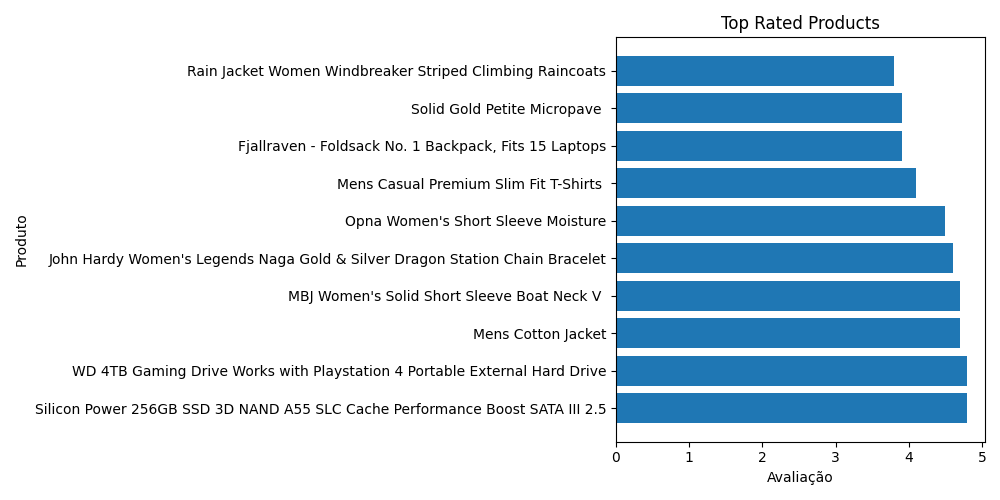
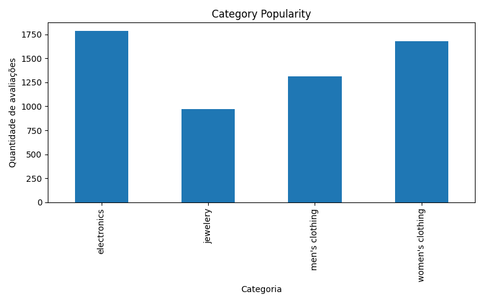

# 📊 API Price Pipeline

Pipeline de engenharia de dados desenvolvido em Python para ingestão, transformação e análise de dados de produtos obtidos via API pública.

---

## 🚀 Tecnologias utilizadas

- Python
- Requests
- Pandas
- SQLite
- Matplotlib

---

## 🧠 Cenário de Negócio

Este projeto simula um pipeline de dados de e-commerce, automatizando a coleta de produtos, transformação dos dados e geração de insights analíticos.

---

## 📂 Estrutura do projeto

api_price_pipeline/
│
├── src/
│   ├── extract.py
│   ├── transform.py
│   ├── load.py
│   ├── visualize.py
│   └── pipeline.py
│
├── database/
├── output/charts/
├── requirements.txt
└── README.md

---

## 🔄 Fluxo do Pipeline

API → Extract → Transform → Load → Visualização

---

## 📊 Insights gerados

### ⭐ Top Produtos por Avaliação



---

### 📦 Popularidade por Categoria



---

## 📌 Funcionalidades

- Consumo de API REST
- Tratamento de dados JSON
- Transformação de dados com Pandas
- Armazenamento em SQLite
- Geração automática de gráficos
- Pipeline automatizado

---

## ▶️ Como executar

1. Clone o repositório

```bash
git clone https://github.com/SEU-USUARIO/api_price_pipeline.git
```

2. Entre na pasta

```bash
cd api_price_pipeline
```

3. Crie ambiente virtual

```bash
python -m venv venv
```

4. Ative o ambiente

Windows:

```powershell
venv\Scripts\activate
```

5. Instale as dependências

```bash
pip install -r requirements.txt
```

6. Execute o pipeline

```bash
python -m src.pipeline
```