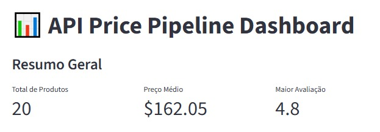
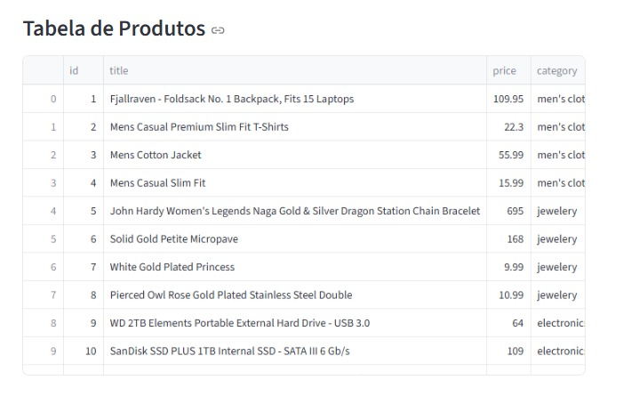
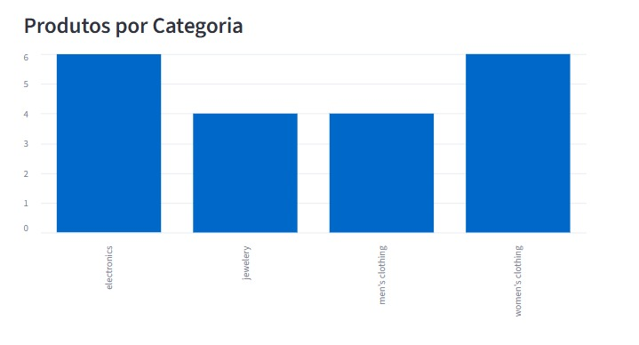
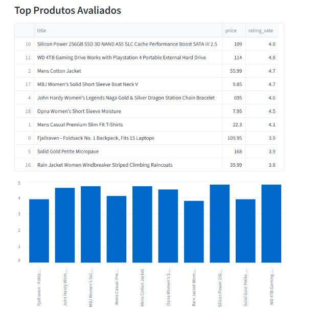

# 📊 API Price Pipeline

Pipeline de engenharia de dados desenvolvido em Python para ingestão, transformação e análise de dados de produtos obtidos via API pública.

---

## 🚀 Tecnologias utilizadas

- Python
- Pandas
- Requests
- PostgreSQL
- SQLAlchemy
- Matplotlib
- Streamlit
- python-dotenv

---

## 🧠 Cenário de Negócio

Este projeto simula um pipeline de dados de e-commerce, automatizando a coleta de produtos, transformação dos dados e armazenamento em banco de dados relacional para análise posterior.

---

## 📂 Estrutura do projeto

* `src/` → scripts do pipeline ETL
* `output/charts/` → gráficos gerados
* `database/` → banco PostgreSQL utilizado no projeto
* `run_pipeline.bat` → automação da execução do pipeline
* `requirements.txt` → dependências do projeto
dashboard/
logs/
.env

---

## 🔄 Fluxo do Pipeline

API → Extract → Transform → PostgreSQL → Dashboard

---

## 📊 Insights gerados

### ⭐ Top Produtos por Avaliação


---

### 📦 Popularidade por Categoria


---

## 📌 Funcionalidades

- Consumo de API REST
- Tratamento de dados JSON
- Transformação de dados com Pandas
- Armazenamento em PostgreSQL
- Geração automática de gráficos
- Logs de execução no terminal
- Pipeline automatizado via `.bat`
- Dashboard interativo
- Logging profissional
- Variáveis de ambiente .env

---

## ▶️ Como executar

### 1. Clone o repositório

```bash
git clone https://github.com/joaomelotjs/api_price_pipeline.git
```

---

### 2. Entre na pasta do projeto

```bash
cd api_price_pipeline
```

---

### 3. Crie o ambiente virtual

```bash
python -m venv venv
```

---

### 4. Ative o ambiente virtual

Windows:

```powershell
venv\Scripts\activate
```

---

### 5. Instale as dependências

```bash
pip install -r requirements.txt
```

---

### 6. Execute o pipeline

```bash
python -m src.pipeline
```

ou execute automaticamente:

```bash
run_pipeline.bat
```

---

## ✅ Resultados

O pipeline realiza automaticamente:

* Extração de dados de produtos via API pública
* Transformação e limpeza dos dados
* Armazenamento em PostgreSQL
* Criação de visualizações analíticas
* Execução automatizada do fluxo completo

📈 Dashboard Interativo

O projeto conta com um dashboard web desenvolvido em Streamlit para visualização dos dados armazenados no PostgreSQL.

O dashboard apresenta:

KPIs gerais


Produtos mais bem avaliados


Distribuição por categoria


Tabela interativa de produtos


Visualizações gráficas em tempo real